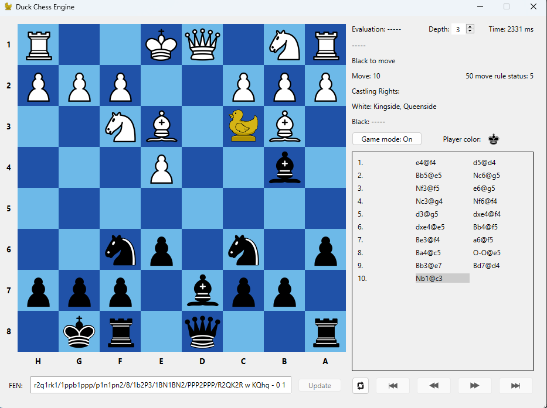
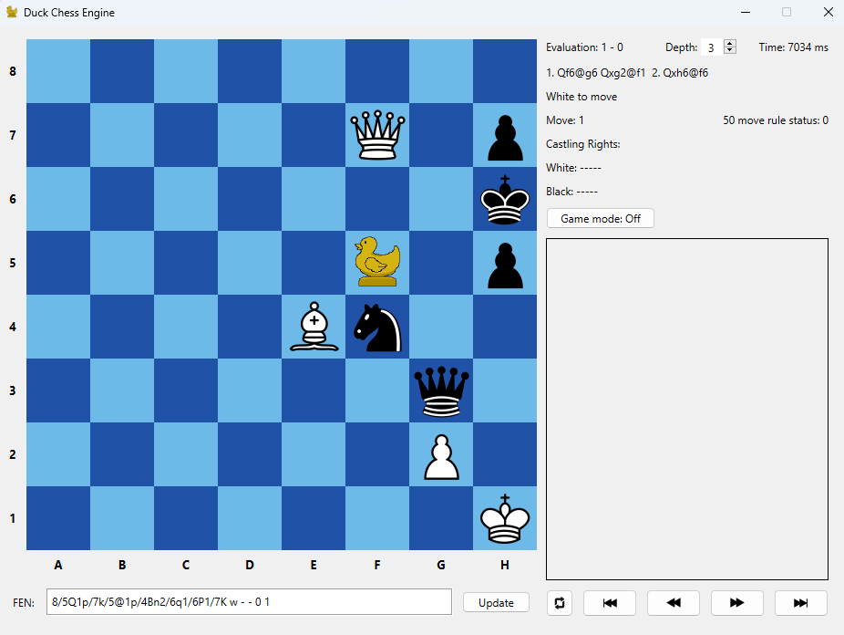

# Duck-Chess
Chess engine for variant "Duck chess" made with C++ and Qt.  

### Functionalities
* Searching for a best move in a given position
* A game mode allowing to play against the AI
* Reading a chess position from FEN
* Easy navigation in the move history panel

 

